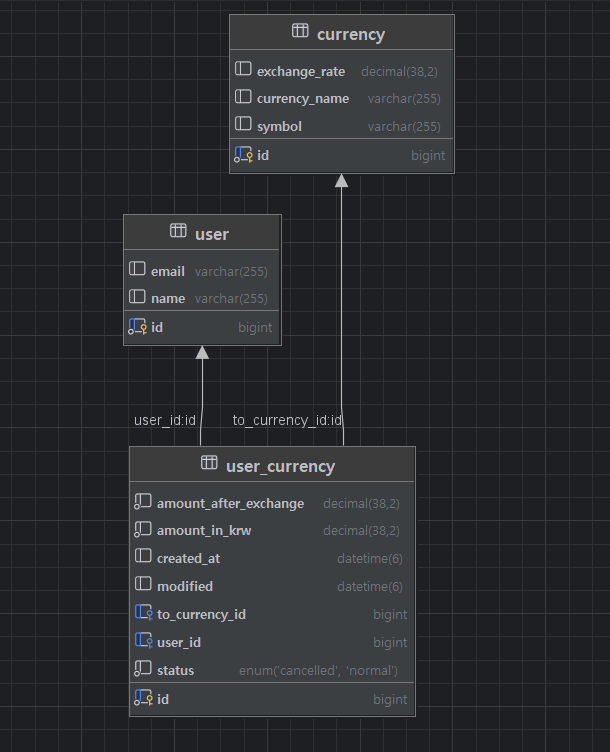

# API 명세서

## User
|     기능      | Method |  URL   |      request      | response |          상태코드        |   
|:-----------:|:------:|:------:|:-----------------:|:--------:|:-----------------------:|
| 유저 등록(회원가입) |  POST  | /users | body:  유저생성 DTO |  생성 정보   | 201: 정상등록 <br/> 400: 오류 |
|    유저 조회    |  GET   | /{id}  | body:  유저수정 DTO |  조회 정보   |        200: 정상조회 <br/> 406: 오류|
|   유저목록 조회   |  GET   | /users |         -         | 목록 조회 정보 |        200: 정상조회 <br/> 404: 오류|
|    유저 삭제    | DELETE |  /id}   |         -         |    -     |        200: 정상삭제 <br/>       |

[//]: # (유저 등록)
<details>
    <summary>유저 등록(회원 가입)</summary>

- 요청 정보
    <table>
      <tr>
        <td ><b>메소드</b></td>
        <td ><b>요청 URL</b></td>
      </tr>
      <tr>
        <td>POST</td>
        <td >/users</td>
      </tr>
    </table>
- 예시
    - 요청: POST /users

  ```json
  {     
        "name" : "홍길동",
        "email" : "a@b.com",
        "password" : 1234
  }
  ```
    - 응답: HTTP/1.1 200 OK

  ```json
  {
        "id" : 1,
        "name" : "홍길동",
        "email" : "a@b.com"
  }
  ``` 
  
</details>

[//]: # (유저 조회)
<details>
    <summary>유저 조회</summary>

- 요청 정보
    <table>
      <tr>
        <td ><b>메소드</b></td>
        <td ><b>요청 URL</b></td>
      </tr>
      <tr>
        <td>GET</td>
        <td >/users/{id}</td>
      </tr>
    </table>
- 예시
    - 요청: GET /users/1

    - 응답: HTTP/1.1 200 OK

  ```json
    {
        "id" : 1,
        "name" : "홍길동",
        "email" : "a@b.com"
  }
  ```
</details>

[//]: # (유저 목록 조회)
<details>
    <summary>유저 목록 조회</summary>

- 요청 정보
    <table>
      <tr>
        <td ><b>메소드</b></td>
        <td ><b>요청 URL</b></td>
      </tr>
      <tr>
        <td>GET</td>
        <td >/users</td>
      </tr>
    </table>
- 예시
    - 요청: GET /users

    - 응답: HTTP/1.1 200 OK

  ```json
    [{
        "id" : 1,
        "name" : "홍길동",
        "email" : "a@b.com"
  },
  {
        "id" : 2,
        "name" : "김길동",
        "email" : "a@bc.com"
  },
  {
        "id" : 3,
        "name" : "박길동",
        "email" : "a@bcd.com"
  }
  ]
  ```
</details>

[//]: # (유저 삭제)
<details>
    <summary>유저 삭제</summary>

- 요청 정보
    <table>
      <tr>
        <td ><b>메소드</b></td>
        <td ><b>요청 URL</b></td>
      </tr>
      <tr>
        <td>DELETE</td>
        <td>/users/{id}</td>
      </tr>
    </table>

- 예시
    - 요청: DELETE /users/1
    - 응답: HTTP/1.1 200 OK
</details>

## Currency

|    기능    | Method |       URL        |    request     | response |          상태코드         |  
|:--------:|:------:|:----------------:|:--------------:|:--------:|:-----------------------:|
|  화폐 등록   |  POST  |   /currencies    | body: 화폐생성 DTO |  등록 정보   | 201: 정상등록 <br/> 400: 오류 |
|  화폐 조회   |  GET   | /currencies/{id} |       -        | 단건 응답 정보 |        200: 정상조회 <br/> 404: 오류|
| 화폐 목록 조회 |  GET   |   /currencies    |       -        | 다건 응답 정보 |        200: 정상조회 <br/> 400: 오류   |    

[//]: # (화폐 등록)
<details>
    <summary>화폐 등록</summary>

- 요청 정보
    <table>
      <tr>
        <td ><b>메소드</b></td>
        <td ><b>요청 URL</b></td>
      </tr>
      <tr>
        <td>POST</td>
        <td >/currencies</td>
      </tr>
    </table>
- 예시
    - 요청: POST /currencies

  ```json
  {     
        "currencyCode" : "USD",
        "exchangeRate" : "1430.00",
        "symbol" : "$"
  }
  ```
    - 응답: HTTP/1.1 201 Created

  ```json
  {     
        "id" : 1,
        "currencyCode" : "USD",
        "exchangeRate" : "1430.00",
        "symbol" : "$"
  }
  ```
</details>

[//]: # (화폐 조회)
<details>
    <summary>화폐 조회</summary>

- 요청 정보
    <table>
      <tr>
        <td ><b>메소드</b></td>
        <td ><b>요청 URL</b></td>
      </tr>
      <tr>
        <td>GET</td>
        <td >/currencies/{id}</td>
      </tr>
    </table>
- 예시
    - 요청: GET /currencies/1

    - 응답: HTTP/1.1 200 OK

  ```json
  {     
        "id" : 1,
        "currencyCode" : "USD",
        "exchangeRate" : "1430.00",
        "symbol" : "$"
  }
  ```
</details>

[//]: # (화폐 목록 조회)
<details>
    <summary>화폐 목록 조회</summary>

- 요청 정보
    <table>
      <tr>
        <td ><b>메소드</b></td>
        <td ><b>요청 URL</b></td>
      </tr>
      <tr>
        <td>GET</td>
        <td >/currencies</td>
      </tr>
    </table>
- 예시
    - 요청: GET /currencies

    - 응답: HTTP/1.1 200 OK
  ```json
  [{     
        "id" : 1,
        "currencyCode" : "USD",
        "exchangeRate" : "1430.00",
        "symbol" : "$"
  },
  {     
        "id" : 2,
        "currencyCode" : "JPY",
        "exchangeRate" : "9.19",
        "symbol" : "￥"
  },
  {     
        "id" : 3,
        "currencyCode" : "EUR",
        "exchangeRate" : "1474.38",
        "symbol" : " €"
  }
  ]
  ```
</details>

## UserCurrency(환전 정보)

|     기능      | Method |           URL           |    request     | response |          상태코드          | 
|:-----------:|:------:|:-----------------------:|:--------------:|:--------:|:-----------------------:|
|    환전 요청    |  POST  |       /exchanges        | body: 환전요청 DTO |  등록 정보   | 200: 정상등록 <br/> 400: 오류 |
|  환전 정보 조회   |  GET   |       /exchanges        |       -        | 단건 응답 정보 | 200: 정상조회 <br/> 404: 오류 |
| 환전 정보 토탈 조회 |  GET   |    /exchanges/total     |       -        | 단건 응답 정보 | 200: 정상조회 <br/> 400: 오류 |
|  환전 정보 수정   | PATCH  | /exchanges/{exchangeId} |       -        |    -     | 200: 정상조회 <br/> 400: 오류 |

[//]: # (환전 요청)
<details>
    <summary>환전 요청</summary>

- 요청 정보
    <table>
      <tr>
        <td ><b>메소드</b></td>
        <td ><b>요청 URL</b></td>
      </tr>
      <tr>
        <td>POST</td>
        <td >/exchanges</td>
      </tr>
    </table>
- 예시
    - 요청: POST /exchanges

  ```json
  {     
        "currencyCode" : "USD",
        "money" : 10000
  }
  ```
    - 응답: HTTP/1.1 200 OK

  ```json
  {     
        "name" : "홍길동",
        "currencyCode" : "USD",
        "beforeExchange" : 10000,
        "afterExchange" : 6.99,
        "status" : "NORMAL",
        "createdAt" : "2024-11-29:000000"
  }
  ```
</details>

[//]: # (환전 정보 조회)
<details>
    <summary>환전 정보 조회</summary>

- 요청 정보
    <table>
      <tr>
        <td ><b>메소드</b></td>
        <td ><b>요청 URL</b></td>
      </tr>
      <tr>
        <td>GET</td>
        <td >/exchanges</td>
      </tr>
    </table>
- 예시
    - 요청: GET /exchanges

    - 응답: HTTP/1.1 200 OK

  ```json
  [{     
        "name" : "홍길동",
        "currencyCode" : "USD",
        "beforeExchange" : 10000,
        "afterExchange" : 6.99,
        "createdAt" : "2024-11-29:000000"
  },
  {     
        "name" : "홍길동",
        "currencyCode" : "JPY",
        "beforeExchange" : 10000,
        "afterExchange" : 1088.13,
        "createdAt" : "2024-11-29:000000"
  },
  {     
        "name" : "홍길동",
        "currencyCode" : "EUR",
        "beforeExchange" : 10000,
        "afterExchange" : 6.78,
        "createdAt" : "2024-11-30:000000"
  }
  ]
  ```
</details>

[//]: # (환전 정보 조회)
<details>
    <summary>환전 정보 토탈 조회</summary>

- 요청 정보
    <table>
      <tr>
        <td ><b>메소드</b></td>
        <td ><b>요청 URL</b></td>
      </tr>
      <tr>
        <td>GET</td>
        <td >/exchanges/total</td>
      </tr>
    </table>
- 예시
    - 요청: GET /exchanges/total

    - 응답: HTTP/1.1 200 OK
  ```json
  {     
        "totalCount" : 3,
        "totalSum" : 30000.00
  }

  ```
</details>

[//]: # (환전 정보 수정)
<details>
    <summary>환전 정보 수정</summary>

- 요청 정보
    <table>
      <tr>
        <td ><b>메소드</b></td>
        <td ><b>요청 URL</b></td>
      </tr>
      <tr>
        <td>PATCH</td>
        <td >/exchanges/{exchangeId}</td>
      </tr>
    </table>
- 예시
    - 요청: PATCH /exchanges/1

    - 응답: HTTP/1.1 200 OK
  ```json
  {     
        "id" : 1
  }

  ```
</details>

# ERD

---


# SQL

---
```

  create table user (
          id bigint not null auto_increment,
          email varchar(255),
          name varchar(255),
          password varchar(255),
          primary key (id)
      ) engine=InnoDB
      
  create table currency (
        exchange_rate decimal(38,2) not null,
        id bigint not null auto_increment,
        symbol varchar(255),
        currency_code enum ('EUR','JPY','USD') not null,
        primary key (id)
    ) engine=InnoDB
    
  create table user_currency (
        amount_after_exchange decimal(38,2) not null,
        amount_in_krw decimal(38,2) not null,
        created_at datetime(6),
        id bigint not null auto_increment,
        modified datetime(6),
        to_currency_id bigint,
        user_id bigint,
        status enum ('CANCELLED','NORMAL') not null,
        primary key (id)
    ) engine=InnoDB

```
